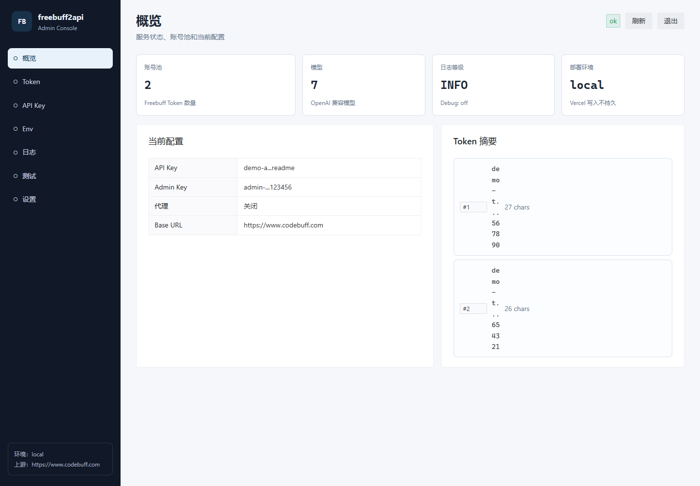
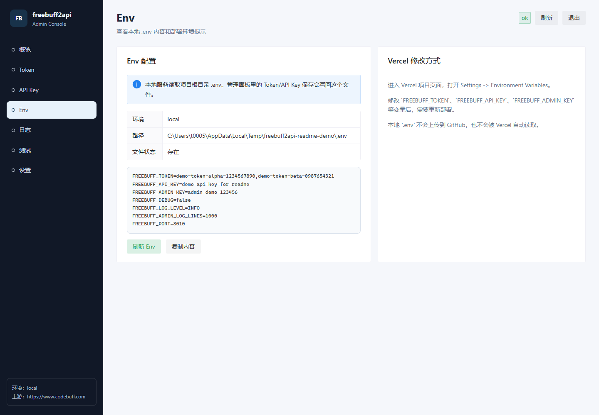
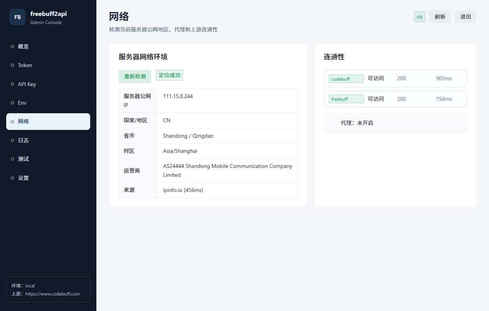
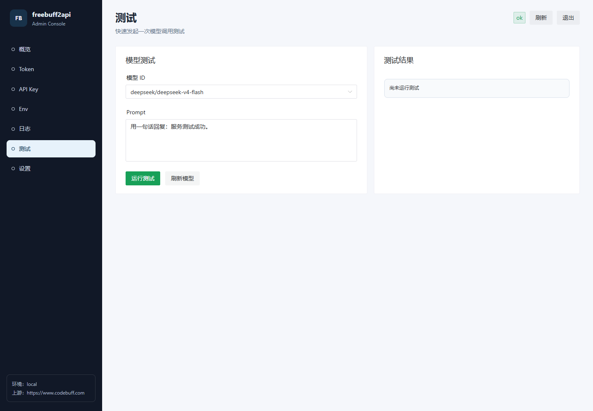

# freebuff2api

An OpenAI-compatible API adapter for Codebuff Freebuff. After deployment, you can call Freebuff models just like OpenAI Chat Completions.

[](https://vercel.com/new/clone?repository-url=https://github.com/t479842598/freebuff2api-vercel&env=FREEBUFF_TOKEN,FREEBUFF_API_KEY,FREEBUFF_ADMIN_KEY&envDescription=FREEBUFF_TOKEN:Freebuff%20token,FREEBUFF_API_KEY:API%20access%20key,FREEBUFF_ADMIN_KEY:Admin%20panel%20login%20key&envLink=https://github.com/t479842598/freebuff2api-vercel&project-name=freebuff2api-vercel&repository-name=freebuff2api-vercel)

## Changelog

### 2026-06-10

- Synced Freebuff upstream compatibility logic from the original project `freebuff2api-main-oran`: HAR-style request headers, fixed upstream User-Agent, `Accept-Encoding` / `Connection` / `Host` fingerprinting, `/api/v1/freebuff/streak` call after waiting-room ad chain.
- Synced OpenAI message normalization: `developer` role converted to `system`, system messages get `cache_control: ephemeral`, auto-inject `You are Buffy...` upstream prompt when system message is missing.
- Added Freebuff model mappings: `minimax/minimax-m3`, `mimo/mimo-v2.5`, `mimo/mimo-v2.5-pro`.
- Removed `FREEBUFF_BROWSER_UA` example config; uses fixed HAR browser UA to avoid accidental upstream fingerprint changes.
- Retained current admin edition features: `/admin` panel, Vercel entry point, API Key initialization protection, log buffering, local `.env` write-back, and deployment docs.
- Restricted pytest to only collect the current project's `tests/`, avoiding interference from identically named tests in the original project's snapshot directory.

## Features

- OpenAI-compatible Chat Completions API — works with any OpenAI-format client.
- Supports streaming and non-streaming with the standard `/v1/chat/completions` endpoint.
- Built-in Freebuff / Gemini free agent model mappings, available via `/v1/models`.
- Multiple `FREEBUFF_TOKEN` account pool; concurrent requests prioritize idle accounts.
- Local API Key authentication to protect `/v1/*` endpoints in public deployments.
- Built-in Vue 3 + Naive UI admin panel for managing tokens, API keys, env, logs, and model testing.
- Vercel deployment support; the admin panel clearly indicates that Vercel env variables must be modified in the dashboard and redeployed.

## Endpoints

- `GET /healthz`
- `GET /v1/models`
- `POST /v1/chat/completions`
- `GET /admin` — Admin panel

## Quick Start

### 1. Get a Freebuff Token

No need to install the Freebuff / Codebuff CLI. Open the public page to get a token:

```text
https://freebuff.071129.xyz/
```

Steps:

1. Open the URL above.
2. Select `Freebuff`.
3. Click "Start Auth" and complete authorization on the redirected page.
4. Copy the displayed token.
5. Write it to `.env` for local use, or to Vercel Environment Variables for deployment.

Example:

```dotenv
FREEBUFF_TOKEN=your Freebuff Bearer token
```

Multiple tokens can be separated by commas. Concurrent requests will prioritize idle accounts, preventing a single Freebuff account's active free session from being overwritten by concurrent model requests:

```dotenv
FREEBUFF_TOKEN=token-a,token-b,token-c
```

### 2. Local Configuration

Create a `.env` file and fill it in:

```dotenv
FREEBUFF_TOKEN=your Freebuff Bearer token
FREEBUFF_API_KEY=
FREEBUFF_ADMIN_KEY=sk-admin
FREEBUFF_API_BASE_URL=https://www.codebuff.com
FREEBUFF_AD_PROVIDERS=gravity,zeroclick
FREEBUFF_TIMEOUT=60
FREEBUFF_PROXY_ENABLED=false
FREEBUFF_PROXY_URL=
FREEBUFF_DEBUG=false
FREEBUFF_LOG_LEVEL=INFO
FREEBUFF_LOG_BODY_CHARS=2000
FREEBUFF_LOG_COLOR=true
FREEBUFF_ADMIN_LOG_LINES=1000
FREEBUFF_HOST=0.0.0.0
FREEBUFF_PORT=8000
FREEBUFF_TIMEZONE=Asia/Shanghai
FREEBUFF_LOCALE=zh-CN
FREEBUFF_OS=windows
```

`FREEBUFF_ADMIN_KEY` defaults to `sk-admin`. You can use this default key to log into the admin panel, then change it in the Settings page. Make sure to change it for public deployments.

`FREEBUFF_TOKEN` and `FREEBUFF_API_KEY` can be left blank initially and filled in via the admin panel. On local/persistent servers, saving will write back to `.env` and hot-reload in the current process. On Vercel, the environment variable text will be returned for you to paste.

`FREEBUFF_API_KEY` is the access key you set for this API service. Once set, requests must include:

```http
Authorization: Bearer your local API key
```

If `FREEBUFF_API_KEY` is left empty, the `/v1/*` API will return a configuration error to prevent unauthorized access in public deployments. The admin panel remains accessible for initialization.

### 3. Local Run

Recommended with `uv`:

```powershell
uv sync
uv run freebuff2api
```

Or with `pip`:

```powershell
python -m pip install -r requirements.txt
python main.py
```

After starting, visit:

```text
http://127.0.0.1:8000/healthz
```

## Admin Panel

After starting the service, visit:

```text
http://127.0.0.1:8000/admin
```

The admin panel is built with Vue 3 + Naive UI (browser version, no separate frontend build required). It includes:

- **Overview**: Service status, account pool count, model count, log level, and deployment environment.
- **Token Management**: Displays Freebuff Tokens in a list (masked by default). Clicking "Add" opens the token retrieval page; copy the token and paste it back. Supports inline edit, delete, and per-token verification.
- **API Key**: Manage `FREEBUFF_API_KEY` separately for `/v1/*` endpoint authorization.
- **Env**: View the project's `.env` content and copy the current configuration text.
- **Network**: Detect server public IP, country/region, city, timezone, ISP, proxy status, and Codebuff/Freebuff connectivity.
- **Logs**: View recent in-memory runtime logs. Auto-refresh is enabled by default on the logs page. Supports level filtering, manual refresh, and copy.
- **Model Test**: Select a model from the `/v1/models` list and run a simple non-streaming test call.
- **Settings**: Change `FREEBUFF_ADMIN_KEY`; requires re-login after saving.

Note: To avoid accidental key exposure, the token list never shows the full token. Only when you click "Edit" on a row does the server read and display the full token in a dialog.

### Admin Panel Screenshots

Overview:



Token Management:


API Key Management:


Env View:



Network Detection:



Runtime Logs:


Model Test:



### Vercel Limitations

The admin panel can be deployed with Vercel, but Vercel's serverless environment does not support persistent `.env` writes at runtime. When using the admin panel on Vercel:

- The status, logs, and model test pages reflect the current function instance's state only.
- Token/API Key save pages return the environment variable text to configure, e.g., `FREEBUFF_TOKEN=...`.
- The Env page will direct you to modify variables in Vercel's `Settings` -> `Environment Variables`.
- Go to the Vercel project's `Settings` -> `Environment Variables` to paste variables and redeploy.
- Changes to `FREEBUFF_ADMIN_KEY` / `FREEBUFF_API_KEY` also need to be persisted through Vercel environment variables.

## Deployment

### Local or Server Deployment

Suitable for personal computers, VPS, cloud servers, NAS, or any environment that can run a long-lived Python process.

1. Prepare `.env` with at least `FREEBUFF_TOKEN`, `FREEBUFF_API_KEY`, `FREEBUFF_ADMIN_KEY`.
2. Install dependencies and start:

```powershell
python -m pip install -r requirements.txt
python main.py
```

Or with `uv`:

```powershell
uv sync
uv run freebuff2api
```

Listens on `0.0.0.0:8000` by default. To change the port, set in `.env`:

```dotenv
FREEBUFF_HOST=0.0.0.0
FREEBUFF_PORT=8000
```

On local/persistent servers, admin panel Token/API Key/Admin Key saves write back to the project root `.env` and take effect immediately in the current process. For production, use a process manager like systemd, PM2, Docker, Supervisord, or Windows Task Scheduler.

### GitHub + Vercel Auto Deploy

Suitable for pushing the project to GitHub and having Vercel automatically build and redeploy.

Workflow:

1. Make sure `.env` is not committed to GitHub (the `.gitignore` already ignores `.env`).
2. Push the code to your GitHub repository.
3. Import the GitHub repository into Vercel.
4. Add variables in Vercel project `Settings` -> `Environment Variables`.
5. Click `Deploy` after the first import.
6. Subsequent pushes to the linked branch will trigger automatic Vercel redeployment.

If you only modify Vercel environment variables (e.g., `FREEBUFF_TOKEN`, `FREEBUFF_API_KEY`, `FREEBUFF_ADMIN_KEY`), they won't change automatically with a GitHub push. Go to Vercel `Deployments` and manually click `Redeploy` to apply the new environment variables.

The admin panel is accessible on Vercel but cannot persist `.env` writes. The Env page will prompt you to modify variables in Vercel Environment Variables and redeploy.

### One-Click Vercel Deploy

Click the `Deploy with Vercel` button at the top of this document, follow the prompts to import the repository, and fill in the environment variables.

### Manual Import from GitHub to Vercel

1. Push the project to GitHub.
2. Open Vercel, select `Add New` -> `Project`.
3. Select your GitHub repository and click `Import`.
4. Configure project settings.
5. Add environment variables.
6. Click `Deploy`.

Recommended Vercel configuration:

| Setting | Value |
| --- | --- |
| Application Preset | `FastAPI` |
| Root Directory | `./` |
| Build Command | Leave empty / `None` |
| Output Directory | Leave empty / `N/A` |
| Install Command | `pip install -r requirements.txt` |

The project already includes the Vercel entry point and routing config:

- `api/index.py`: Exports the FastAPI `app`.
- `vercel.json`: Forwards all requests to `/api/index.py`.
- `requirements.txt`: For Vercel to install Python dependencies.

### Environment Variables

Vercel does not read your local `.env` file. Production variables must be configured separately in the Vercel dashboard.

Setup steps:

1. Open your Vercel project page.
2. Go to `Settings` -> `Environment Variables`.
3. Enter the variable name in `Key`, e.g., `FREEBUFF_TOKEN`.
4. Enter the variable value in `Value`, e.g., your Freebuff token.
5. For `Environment`, check at least `Production`; check `Preview` if needed for preview deployments.
6. Click `Save` or `Add`.
7. Repeat for other variables.
8. After adding or modifying, go to `Deployments` and click `Redeploy` on the latest deployment.

At minimum, fill in:

```dotenv
FREEBUFF_TOKEN=your Freebuff Bearer token
FREEBUFF_API_KEY=your API access key
FREEBUFF_ADMIN_KEY=admin panel login key
```

Variable reference:

| Variable | Required | Description |
| --- | --- | --- |
| `FREEBUFF_TOKEN` | Yes | Upstream Freebuff / Codebuff token. Multiple tokens supported, comma-separated. |
| `FREEBUFF_API_KEY` | Strongly recommended | The access key for this API service. Clients use `Authorization: Bearer <FREEBUFF_API_KEY>`. |
| `FREEBUFF_ADMIN_KEY` | Strongly recommended | Login key for the `/admin` panel. Use a different value from `FREEBUFF_API_KEY`. |
| `FREEBUFF_API_BASE_URL` | No | Codebuff upstream URL, default `https://www.codebuff.com`. |
| `FREEBUFF_AD_PROVIDERS` | No | Ad chain providers, default `gravity,zeroclick`. |
| `FREEBUFF_TIMEOUT` | No | Upstream request timeout in seconds, default `60`. |
| `FREEBUFF_PROXY_ENABLED` | No | Whether to enable proxy. Usually `false` on Vercel. |
| `FREEBUFF_DEBUG` | No | Enable debug logging. Set to `true` temporarily for troubleshooting. |
| `FREEBUFF_LOG_LEVEL` | No | Log level, default `INFO`. |
| `FREEBUFF_ADMIN_LOG_LINES` | No | Number of log lines retained in admin panel memory, default `1000`. |
| `FREEBUFF_TIMEZONE` | No | Timezone identifier for upstream requests, default `Asia/Shanghai`. |
| `FREEBUFF_LOCALE` | No | Locale for upstream requests, default `zh-CN`. |
| `FREEBUFF_OS` | No | OS type for upstream simulation, default `windows`. |

Recommended additional variables:

```dotenv
FREEBUFF_API_BASE_URL=https://www.codebuff.com
FREEBUFF_AD_PROVIDERS=gravity,zeroclick
FREEBUFF_TIMEOUT=60
FREEBUFF_PROXY_ENABLED=false
FREEBUFF_DEBUG=false
FREEBUFF_LOG_LEVEL=INFO
FREEBUFF_LOG_BODY_CHARS=2000
FREEBUFF_LOG_COLOR=false
FREEBUFF_ADMIN_LOG_LINES=1000
FREEBUFF_TIMEZONE=Asia/Shanghai
FREEBUFF_LOCALE=zh-CN
FREEBUFF_OS=windows
```

Do not fill in local proxy addresses on Vercel, e.g.:

```dotenv
FREEBUFF_PROXY_URL=socks5://127.0.0.1:7890
```

`127.0.0.1` on Vercel refers to Vercel's own environment, not your machine.

`FREEBUFF_HOST` and `FREEBUFF_PORT` are mainly for local operation and don't need to be set on Vercel.

### Deployment Region

The project already configures the region in `vercel.json`:

```json
{
  "regions": ["iad1"]
}
```

`iad1` is Vercel's Washington, D.C., USA (East) region. Freebuff upstream has IP/region restrictions for free models. It is recommended to keep the US region. Deploying to a non-US region may result in upstream errors like:

```text
Codebuff 409 session_model_mismatch: Limited free access is only available with DeepSeek V4 Flash. Current IP/region restricted; please use a US server or US egress IP and try again.
```

Your previous deployment logs showed:

```text
Running build in Washington, D.C., USA (East) - iad1
```

This indicates the current build runs in `iad1`. After redeployment, it is also recommended to confirm the function region is still `iad1` in the Vercel deployment logs or project settings.

If you need to verify or change the region in Vercel:

1. Open your Vercel project page.
2. Go to `Settings`.
3. Find `Functions` or `Function Region` settings.
4. Select the desired region, e.g., `Washington, D.C., USA (East) - iad1`.
5. Save and redeploy.

Generally, keep `iad1`. The distance from Vercel to your users is not the main bottleneck — the upstream Codebuff/Freebuff egress IP/region restrictions are more critical.

### Custom Domain

Vercel assigns a `*.vercel.app` domain by default. If you have your own domain, you can bind it in the Vercel dashboard.

Setup steps:

1. Open your Vercel project page.
2. Go to `Settings` -> `Domains`.
3. Enter your domain in the input, e.g., `api.example.com` or `example.com`.
4. Click `Add`.
5. Follow Vercel's instructions to add DNS records at your domain registrar.
6. Return to Vercel and wait for validation. When the status changes to `Valid Configuration`, you can access it.

Common DNS configurations:

| Usage | DNS Type | Host Record | Value |
| --- | --- | --- | --- |
| Subdomain, e.g., `api.example.com` | `CNAME` | `api` | `cname.vercel-dns.com` |
| Apex domain, e.g., `example.com` | `A` | `@` | `76.76.21.21` |
| `www.example.com` | `CNAME` | `www` | `cname.vercel-dns.com` |

Different domain registrars may use different field names. `Host Record` may be called `Name`, `Host`, or `Record Name`; `Value` may be called `Target` or `Points to`.

Once DNS propagates, Vercel automatically issues an HTTPS certificate. This usually takes a few minutes, though some registrars may take longer.

After binding, replace the Vercel domain in the examples with your custom domain:

```text
https://api.example.com/v1/chat/completions
```

If you bind both an apex domain and a `www` domain, you can set one as the primary domain in `Settings` -> `Domains`, and the other will automatically redirect. For API services, a separate subdomain like `api.example.com` is recommended.

### Updating Token or Environment Variables

If you only modify Vercel environment variables like `FREEBUFF_TOKEN` or `FREEBUFF_API_KEY` in the Vercel dashboard, go to `Deployments` and click `Redeploy` to apply them.

If you modify code and push to GitHub, Vercel automatically redeploys the linked branch. Usually, pushing to `main` updates the production environment:

```powershell
git add .
git commit -m "Update project"
git push
```

## Usage Examples

Replace the addresses below with your local address or Vercel domain:

```text
http://127.0.0.1:8000
https://your-project-name.vercel.app
```

### Health Check

```powershell
curl https://your-project-name.vercel.app/healthz `
  -H "Authorization: Bearer $env:FREEBUFF_API_KEY"
```

### List Models

```powershell
curl https://your-project-name.vercel.app/v1/models `
  -H "Authorization: Bearer $env:FREEBUFF_API_KEY"
```

### Non-Streaming Chat

```powershell
curl https://your-project-name.vercel.app/v1/chat/completions `
  -H "Authorization: Bearer $env:FREEBUFF_API_KEY" `
  -H "Content-Type: application/json" `
  -d '{
    "model": "deepseek/deepseek-v4-flash",
    "messages": [{"role": "user", "content": "Hello"}],
    "stream": false
  }'
```

### Streaming Chat

```powershell
curl -N https://your-project-name.vercel.app/v1/chat/completions `
  -H "Authorization: Bearer $env:FREEBUFF_API_KEY" `
  -H "Content-Type: application/json" `
  -d '{
    "model": "deepseek/deepseek-v4-flash",
    "messages": [{"role": "user", "content": "Write a Python quicksort"}],
    "stream": true
  }'
```

## Models

Current built-in Freebuff models:

- `deepseek/deepseek-v4-flash`
- `deepseek/deepseek-v4-pro`
- `moonshotai/kimi-k2.6`
- `minimax/minimax-m2.7`
- `minimax/minimax-m3`
- `mimo/mimo-v2.5`
- `mimo/mimo-v2.5-pro`

Current built-in Gemini free agent combinations:

- `google/gemini-2.5-flash-lite` -> `base2-free-deepseek-flash` parent agent + `file-picker` child agent
- `google/gemini-3.1-flash-lite-preview` -> `base2-free-deepseek-flash` parent agent + `file-picker-max` child agent
- `google/gemini-3.1-pro-preview` -> `base2-free-kimi` parent agent + `thinker-with-files-gemini` child agent

No need to manually pass an agent when calling Gemini. The project resolves the OpenAI `model` field into the upstream `agentId + model` combination and continues requesting under `codebuff_metadata.cost_mode=free`. Gemini free agents automatically run as child agents of the active Freebuff session root. Unknown models will not fall back to Gemini.

## Proxy & Debug

Proxy is disabled by default. All upstream requests connect directly and do not read the system `HTTP_PROXY` / `HTTPS_PROXY`.

To route all upstream requests through a proxy locally, enable it in `.env`:

```dotenv
FREEBUFF_PROXY_ENABLED=true
FREEBUFF_PROXY_URL=http://127.0.0.1:7890
```

Supports HTTP and SOCKS proxies:

```dotenv
FREEBUFF_PROXY_URL=http://127.0.0.1:7890
FREEBUFF_PROXY_URL=socks5://127.0.0.1:1080
FREEBUFF_PROXY_URL=socks5h://127.0.0.1:1080
```

For debugging empty responses or upstream errors:

```dotenv
FREEBUFF_DEBUG=true
FREEBUFF_LOG_LEVEL=DEBUG
FREEBUFF_LOG_BODY_CHARS=0
```

## Testing & Verification

After modifying code locally, run the full test suite:

```powershell
python -m pytest -q
```

If only the admin panel or config logic changed, run the relevant tests:

```powershell
python -m pytest tests/test_admin.py tests/test_config.py -q
```

After starting locally, do a basic connectivity check:

```powershell
curl http://127.0.0.1:8000/healthz `
  -H "Authorization: Bearer $env:FREEBUFF_API_KEY"

curl http://127.0.0.1:8000/v1/models `
  -H "Authorization: Bearer $env:FREEBUFF_API_KEY"
```

Admin panel checklist:

1. Open `http://127.0.0.1:8000/admin`.
2. Log in with `FREEBUFF_ADMIN_KEY`; if not set, `FREEBUFF_API_KEY` can be used temporarily.
3. On the Token page, confirm tokens are masked by default; clicking "Add Token" opens `https://freebuff.071129.xyz/` and prompts to paste the token; clicking "Edit" reveals the full token.
4. On the API Key page, confirm you can update `FREEBUFF_API_KEY` independently.
5. On the Env page, confirm local `.env` is displayed; on Vercel, it prompts to use Environment Variables.
6. On the Logs page, confirm you can see current process logs and auto-refresh is enabled by default.
7. On the Test page, confirm the model list comes from `/v1/models`.

After Vercel auto-deployment, run a quick check:

```powershell
curl https://your-project-name.vercel.app/healthz `
  -H "Authorization: Bearer your FREEBUFF_API_KEY"

curl https://your-project-name.vercel.app/v1/models `
  -H "Authorization: Bearer your FREEBUFF_API_KEY"
```

Screenshots in the README are in `docs/images/`. They use demo tokens and demo keys, not real secrets. After updating the admin panel UI, regenerate and replace these PNGs.

## Notes

- Do not commit `.env` to GitHub.
- For public deployments, always set `FREEBUFF_API_KEY` and `FREEBUFF_ADMIN_KEY`.
- Vercel's free plan has Serverless Function execution time limits. Long streaming requests may be affected by platform limitations.
- Changing Vercel environment variables requires manual `Redeploy`; pushing code changes to the linked branch triggers automatic deployment.

## Thanks

> This project is based on [XxxXTeam/freebuff2api](https://github.com/XxxXTeam/freebuff2api).

> [FreeBuff](https://freebuff.com)
